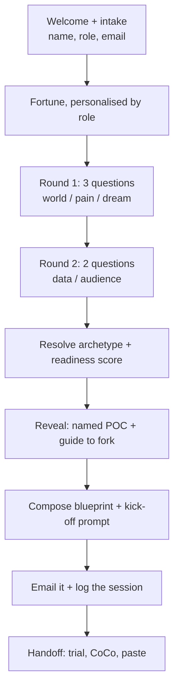

# Loco for CoCo

**Why this skill:** A booth visitor has five minutes, is standing up, and may not be technical. They cannot be taught Snowflake in that window - but they can leave with a concrete, personal plan for something worth building and the exact prompt to build it. That is a better outcome than a demo they watched passively, because it is theirs.

**Not for:** Building the thing. Nothing is deployed to a visitor's account. If they want to build now, hand them to an SE.

## Non-negotiables

0. **Read [`CONSTRAINTS.md`](../../CONSTRAINTS.md) before designing any feature.**
   It records the five properties of the venue that any change has to survive.
   The one most easily forgotten: the booth machine is a **shared demo laptop**,
   so nothing may depend on the visitor saving a file to it. Every takeaway
   leaves on their phone, via a QR to a presigned URL, or by email.
1. **Five minutes, hard.** Track elapsed time from the first message. Past five minutes, cut to the reveal using `ERR.TIME_UP`. A queue is forming.
2. **Two question calls, five questions total.** Round 1 batches three, Round 2 batches two. Never ask them one at a time - that is what makes it a form.
3. **Every question has an Other option.** `ask_user_question` adds "Something else" automatically; do not add a redundant "Other" of your own.
4. **Typing is limited to first name and email.** Everything else is selection.
5. **Never claim the POC is built.** They get a plan and a prompt.
6. **All visitor-facing text comes from the copy deck** (`references/copy-en.md`), by ID. Never hardcode a literal and never show an ID.
7. **Consent before email.** Show `OPEN.CONSENT` before submitting the email field.

## Flow

### Beat 0 - Welcome and intake (target 0:00 - 0:30)

Show `OPEN.WELCOME`. Then **one** `ask_user_question` with three text fields (`OPEN.FIELDS`), each pre-filled so the visitor edits rather than types from scratch:

| Field | Type | Default |
|---|---|---|
| First name | text | `` (empty - they must type this) |
| What you do | text | `Data analyst` |
| Email | text | `you@organisation.gov.uk` |

Show `OPEN.EMAIL_WHY` and `OPEN.CONSENT` alongside. Then the single button `OPEN.BUTTON`.

If they decline an email, continue - use `ERR.NO_EMAIL` at handoff and log the session with `email_provided = FALSE`.

### Beat 1 - The fortune (target 0:30 - 0:45)

Map their stated role to one of `FORTUNE.ROLE.*` (fall back to `FORTUNE.ROLE.OTHER`), then follow with `FORTUNE.GENERIC`.

This is the hook and it must land in about ten seconds. Do not explain the mechanic. Do not caveat it. The fortune promises a *plan*, not a built app - keep it that way.

### Beat 2 - Round 1 (target 0:45 - 2:00)

One `ask_user_question` with `R1.Q1`, `R1.Q2`, `R1.Q3`. Options and routing are in the copy deck.

`R1.Q2` is the primary archetype signal; `R1.Q3` can override it. Load `references/poc-archetypes.md` for the resolution rules.

### Beat 3 - Round 2 (target 2:00 - 3:00)

One `ask_user_question` with `R2.Q1`, `R2.Q2`. These **tune**, they do not re-route: they set scope, choose between the primary and an alternate fork, and feed the readiness score.

### Beat 4 - Resolve (target 3:00 - 3:15)

1. Resolve exactly one archetype. When two are close, prefer the one whose primary feature matches the data they actually have - a POC they can start beats a grander one they cannot.
2. Pick the fork from `references/guides-index.md`. **Only slugs in that index.** If nothing fits, say "no direct guide - building from scratch" and name the features instead. Never invent a slug.
3. Pick one CoCo onboarding guide (default `getting-started-with-coco-desktop`).
4. Score readiness out of 5 and identify the weakest point.
5. Name the POC - short, concrete, in their language, not Snowflake's. "Grant Application Triage", not "AI-Powered Document Classification Solution".

### Beat 5 - Reveal (target 3:15 - 3:45)

`REVEAL.HEADER`, `REVEAL.NAMED`, `REVEAL.BECAUSE` (quote their own words back), `REVEAL.GUIDE`, `REVEAL.SCORE`.

If the score is 2 or below, use `REVEAL.SCORE_LOW`. A low score is a cheap first move, never a failure - and it is the SE's opening for a follow-up.

### Beat 6 - Blueprint and send (target 3:45 - 4:45)

Load `references/prompt-builder.md` and `references/blueprint-and-email.md`. Compose the blueprint, email it, and log the session per `references/session-log.md`.

Do this while talking - do not narrate tool calls to the visitor. If the send fails, use `ERR.SEND_FAILED` and carry on; the on-screen blueprint is the fallback and the session still logs.

### Beat 7 - Handoff (target 4:45 - 5:00)

`HANDOFF.SENT`, `HANDOFF.NEXT`, `HANDOFF.SIGNUP_URL`, `HANDOFF.CLOSE`.

The visitor should leave able to explain to a colleague what CoCo does. If they could not, the run failed regardless of what was emailed - that is the bar from the brief.

## Handling awkward visitors

| Situation | Do |
|---|---|
| "I'm not technical" | Lean in. This archetype set is deliberately non-technical. Say so. |
| "I don't have any data" | Fine - `R2.Q1` has that option. Their POC becomes a shape to try on sample data. |
| Deeply technical, wants depth | Give the advanced fork and offer `build-a-coco-skill`. Still stop at five minutes. |
| A competitor or a student | Same experience. Log role honestly; it is useful. |
| Two people together | Run one session, ask whose email. Log one row and note it. |
| Joke answers | Play along once, then steer. Do not lecture. |
| Wants it built now | Hand to an SE. Do not attempt a build at the booth. |

## Reference index

| Reference | When |
|---|---|
| `references/copy-en.md` | Always - every visitor-facing string |
| `references/poc-archetypes.md` | Beat 4 - archetype resolution and readiness scoring |
| `references/guides-index.md` | Beat 4 - the fork-base. Never invent a slug |
| `references/prompt-builder.md` | Beat 6 - composing the kick-off prompt |
| `references/blueprint-and-email.md` | Beat 6 - blueprint structure and email delivery |
| `references/session-log.md` | Beat 6 - the Snowflake session row and consent wording |
